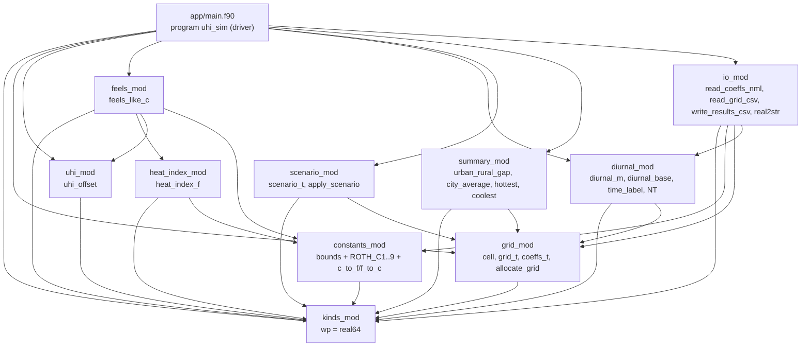
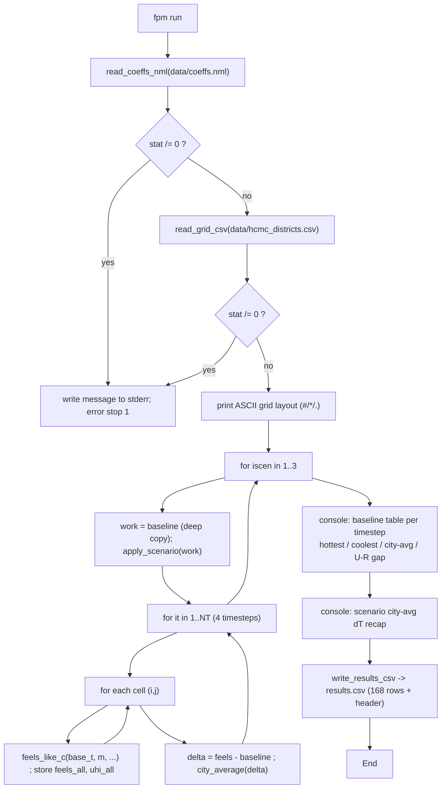
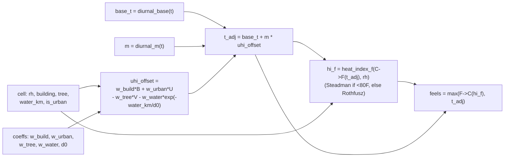

# Architecture — Fortran Fortress (HCMC UHI Simulator)

Tài liệu kỹ thuật cốt lõi: kiến trúc, sơ đồ, mô hình dữ liệu, **trade-off**, **tiêu chí chấp
nhận**, và **lý do** cho từng quyết định kỹ thuật. Tham chiếu chéo nhật ký quyết định
[`DECISION_LOGS.md`](DECISION_LOGS.md) qua mã `D-NN`.

---

## 1. Mục tiêu & hình dạng hệ thống

Đây là một **batch scientific pipeline** (không phải service): một lần `fpm run` đọc cấu hình +
lưới một lần, quét một chồng kernel vật lý `elemental pure` qua các mốc giờ và kịch bản, rồi ghi
CSV + tóm tắt console, và thoát ([D-40]). Giá trị cốt lõi là **pattern không gian đáng tin**:
ô đô thị nóng hơn ô xanh/ven sông, và gap đô thị–nông thôn **ban đêm > giữa trưa** ([D-01]).

Bất biến kiến trúc lớn nhất: **đồ thị `use` giữa các module là acyclic, phân tầng từ dưới lên**
([D-41]) — nhờ đó `fpm` tự suy được thứ tự biên dịch hợp lệ ([D-08], [D-31]).

---

## 2. Đồ thị phụ thuộc module (acyclic, foundation-first)



Tầng từ thấp lên cao: **kinds → constants/grid → heat_index/uhi/diurnal/scenario/summary →
feels → io → main**. Mọi cạnh chỉ hướng xuống; không có chu trình. Một module một file ([D-42]).

> Lưu ý cạnh `io_mod → diurnal_mod`: được thêm ở Phase 4 để CSV writer lấy `diurnal_base`/
> `time_label`/`NT` — vẫn acyclic vì `diurnal_mod` không `use` `io_mod` ([D-126]).

---

## 3. Luồng thực thi (một `fpm run`)



Đặc điểm: validation **fail-loud** ở đầu (chỉ driver `error stop`, [D-46]); baseline **bất biến**
nhờ `work = baseline` deep-copy ([D-45], [D-107]); feels được **giữ lại** trong mảng 4D
`feels_all`/`uhi_all` để ghi CSV một lần sau vòng lặp ([D-125], [D-127]).

---

## 4. Hợp thành công thức feels-like (mỗi ô)



- **uhi_offset** ([D-52], [D-19]): xây dựng & đô thị nâng; cây & gần nước hạ; nước qua
  `Wprox = exp(-water_km/d0)` ([D-53]).
- **t_adj** ([D-101]): nền diurnal + offset đã scale theo giờ. `base_t` đồng nhất toàn thành phố
  ([D-102]).
- **heat_index_f** ([D-89]): hai nhánh NWS, tính nội bộ °F ([D-51], [D-90]).
- **sàn `max(...)`** ([D-91]): feels không bao giờ tụt dưới `t_adj` → đảm bảo HEAT-02.

> **Vì sao gap đêm > trưa.** Vì `base_t` đồng nhất nên nó **triệt tiêu** trong hiệu
> đô thị–nông thôn: `gap = m(t)·(offset_urban − offset_rural)`. `m` nhỏ nhất giữa trưa (0.3) và
> lớn nhất pre-dawn (1.0) ⇒ gap đỉnh ban đêm dù buổi chiều nóng tuyệt đối nhất ([D-54], [D-102],
> [D-110]). Heat-index phi tuyến khiến evening đôi khi nhỉnh hơn pre-dawn, nên test chỉ khoá
> *hướng* `gap_predawn > gap_afternoon`, không khoá pre-dawn là cực đại ([D-113]).

---

## 5. Trách nhiệm thành phần

| Module / file | Trách nhiệm | Thủ tục/kiểu chính | Decision |
|---------------|-------------|--------------------|----------|
| `kinds.f90` | Một "núm" độ chính xác | `wp = real64` | [D-32] |
| `constants.f90` | Bound validation + hệ số Rothfusz + đổi °C↔°F | `T_MIN/MAX`, `ROTH_C1..9`, `c_to_f`, `f_to_c` | [D-75], [D-90] |
| `grid.f90` | Mô hình dữ liệu | `type(cell)`, `grid_t`, `coeffs_t`, `allocate_grid` | [D-44], [D-73] |
| `heat_index.f90` | Heat index NWS (°F) | `heat_index_f` *(elemental pure)* | [D-89] |
| `uhi.f90` | Offset UHI cộng tính | `uhi_offset` *(elemental pure)* | [D-52] |
| `feels.f90` | Hợp thành + sàn feels-like | `feels_like_c` *(elemental pure)* | [D-91] |
| `diurnal.f90` | Tra cứu giờ trong ngày | `diurnal_m`, `diurnal_base`, `time_label`, `NT=4` | [D-103], [D-104] |
| `scenario.f90` | Copy-then-mutate kịch bản | `scenario_t`, `apply_scenario` | [D-105], [D-106] |
| `summary.f90` | Reductions thống kê | `urban_rural_gap`, `city_average`, `hottest`, `coolest` | [D-109], [D-124] |
| `io.f90` | Đọc config/lưới + ghi CSV + format | `read_coeffs_nml`, `read_grid_csv`, `write_results_csv`, `real2str` | [D-46], [D-118], [D-132] |
| `app/main.f90` | Driver orchestrate | `program uhi_sim` | [D-40], [D-77] |

Ranh giới cứng: **kernel vật lý `elemental pure`, không I/O / không state**; I/O chỉ ở `io_mod`
+ driver ([D-43], [D-47]).

---

## 6. Mô hình dữ liệu

```mermaid
classDiagram
    class cell {
      +character name
      +integer i, j
      +real(wp) t_air
      +real(wp) rh
      +real(wp) water_km
      +real(wp) building
      +real(wp) tree
      +logical is_urban
      +logical occupied
    }
    class grid_t {
      +integer nx, ny, ndist
      +cell cells allocatable_2D
    }
    class coeffs_t {
      +real(wp) w_build, w_urban, w_tree, w_water
      +real(wp) m_morning..m_predawn
      +real(wp) base_morning..base_predawn
      +real(wp) add_trees_delta, concrete_delta
      +real(wp) d0
      +integer nx, ny
    }
    class scenario_t {
      +character label
      +logical is_baseline
      +real(wp) tree_delta
      +real(wp) building_delta
    }
    grid_t "1" o-- "nx*ny" cell : cells(:,:)
```

- Mọi trường vật lý lưu `real(wp)` (đổi từ nguồn lúc load) → không integer-division ([D-58]).
- Trường real có default `= 0.0_wp` → ô trống tính feels trên 0 đã-định-nghĩa, không trúng
  signalling NaN dưới `-finit-real=snan` ([D-59]).
- Cờ `occupied` (default `.false.`) dung nạp raster thưa ([D-68], [D-74]).

---

## 7. Quyết định kỹ thuật chính + lý do

| Lĩnh vực | Quyết định | Lý do (tóm tắt) | Ref |
|----------|-----------|------------------|-----|
| Build | fpm thay Makefile; cờ qua `--flag` | fpm tự giải thứ tự module; fpm 0.13.0 từ chối `[profiles.*]` | [D-08], [D-82] |
| Độ chính xác | `wp=real64`, `_wp` mọi literal | Rothfusz nhiều số hạng triệt tiêu, single-precision mất chính xác âm thầm | [D-32], [D-57] |
| Module | Acyclic, một-file-một-module, kernel `elemental pure` | fpm derive build-order; kernel broadcast + test đơn vị dễ | [D-41], [D-43] |
| Vật lý | Heat-index + offset UHI cộng tính, một ngân sách áp một lần | Mỗi driver = °C diễn giải được; tránh double-count B3 | [D-52], [D-92] |
| Heat index | NWS hai nhánh, tính °F, có sàn `max(HI, t_adj)` | Rothfusz vô hiệu dưới ~80 °F; đêm HCMC sát mép → sàn giữ HEAT-02 | [D-89], [D-91] |
| Diurnal | `base(t)` đồng nhất + `m(t)` scale offset, lookup table | base triệt tiêu trong gap → gap do `m·offset`, test độc lập đường cong | [D-101], [D-102] |
| Scenario | copy-then-mutate, một driver, clamp [0,1] | Baseline bất biến miễn phí (deep-copy gán); apples-to-apples | [D-106], [D-107] |
| I/O | namelist + delimited; parse comma thủ công + iostat từng field | List-directed vỡ với tên nhiều-từ; fail-loud cần lỗi từng-field | [D-33], [D-71] |
| CSV | formatted `write` width-free, `.` decimals, deterministic | Không thư viện; tránh `*****` (A9); byte-reproducible | [D-34], [D-120] |
| `t_air` | reference-only (cột CSV), KHÔNG vào feels | Nạp `t_air` từng-ô sẽ double-count UHI mô hình đang tách | [D-115], [D-117] |
| Test | test-drive; archetype tổng hợp in-test; rank/sign | Test mô hình không test data; mô hình minh hoạ nên rank/sign | [D-36], [D-99] |

---

## 8. Trade-off (đã cân nhắc & chọn)

| Chọn | Phương án loại | Vì sao loại |
|------|----------------|-------------|
| fpm | Makefile thủ công / CMake | Makefile dễ vỡ thứ tự `.mod` khi module tăng; CMake thừa boilerplate ở quy mô này ([D-31]) |
| AoS `cell` + grid allocatable | SoA / mảng song song | Penalty cache không đáng ở cỡ quận; AoS khớp input một-dòng-một-ô, rõ ràng ([D-44]) |
| `base(t)` đồng nhất | Per-cell `t_air` vào feels | Per-cell air temp double-count UHI; uniform base giữ "cùng nền thời tiết" trung thực ([D-84], [D-115]) |
| Lookup table 4 mốc | Đường cong cosine liên tục | Đơn giản, learner-tunable; cosine (REFN-03) hoãn v2 ([D-104]) |
| `Wprox = exp(−d/d0)` liên tục | Ngưỡng near/far | Gradient không gian mượt, đáng kéo REFN-02 vào v1 ([D-86]) |
| Hard direction + soft magnitude | Hard-assert biên độ 3–8 °C | Trọng số minh hoạ chứ không fit; assert biên độ tạo fail giòn ([D-110]) |
| `gap_predawn > gap_afternoon` (cặp) | `gap_predawn` là max toàn cục | HI phi tuyến cho evening nhỉnh hơn pre-dawn → over-constrain = fail giả ([D-113]) |
| Width-free `F0.2` + `real2str` | Fixed-width `Fw.d` (CSV) | Fixed-width tràn `*****` khi overflow (A9); `real2str` thêm số 0 đứng đầu mà vẫn width-free ([D-34], [D-132]) |
| Console fixed-width `F7.2`/`F8.2` (giữ) | Width-free trong bảng | Width-free phá canh cột; nhiệt độ bị validation bound nên không tràn ([D-131] WR-03) |
| Serial loops | OpenMP | Lưới vài micro-giây; song song thêm race + output không tất định, lợi ích 0 ([D-39]) |
| Chỉ intrinsics | fortran-stdlib | `maxloc`/`minloc`/`sum`/`count` đủ; dependency thêm chi phí build ([D-35]) |

---

## 9. Tiêu chí chấp nhận (acceptance criteria) & cách kiểm chứng

Mọi test chạy dưới cờ nghiêm ngặt
`-std=f2018 -fcheck=all -ffpe-trap=invalid,zero,overflow -Wall -Wextra -finit-real=snan` ([D-37]).

| Requirement | Tiêu chí TRUE | Cơ chế | Test (test-drive) |
|-------------|---------------|--------|-------------------|
| `GRID-01/02/03/04` | Lưới nạp từ file sửa được; ô đủ thuộc tính; archetype thực; hệ số trong config | `read_grid_csv` + `read_coeffs_nml`, validate range + fail-loud | `test_io` (valid/bad_cols/bad_num/bad_rh/bad_dup/bad_dims/bad_header/bad_empty), `test_e2e_load` |
| `HEAT-01` | Feels-like mỗi ô từ T + RH | `feels_like_c` | `test_ordering`, `test_heat_index` |
| `HEAT-02` | Guard ngưỡng 80 °F; ô đêm không cho feels < air | hai nhánh + sàn `max` | `test_heat_index` (`boundary`, `ref_values`), `test_ordering` (`floor_edge`) |
| `UHI-01` | Build/đô thị nâng, cây/nước hạ, single-digit °C | `uhi_offset` một ngân sách | `test_uhi` (`test_signs`, `test_monotonicity`, `test_magnitude`) |
| `UHI-02` | Đô thị dày đặc xếp nóng hơn xanh/ven sông/nông thôn | archetype in-test, rank | `test_ordering` (`archetype_ordering`, `monotonicity`) |
| `TIME-01` | Đánh giá 4 mốc giờ | `diurnal_m`/`diurnal_base`/`NT` | `test_diurnal` |
| `TIME-02` | `gap_night > gap_afternoon`; đêm sane | `urban_rural_gap` mỗi timestep | `test_gap` (`hard_direction`, `hard_night_sanity`, `soft_magnitude`), `test_realgrid_gap` |
| `SCEN-01` | Baseline không bị mutate | `work = baseline` deep-copy | `test_scenario` (`test_immutability`) |
| `SCEN-02` | Delta theo ô + city-average, một driver, clamp | `apply_scenario` + `city_average` | `test_scenario` (`test_one_driver`, `test_clamp`, `test_delta_sign`) |
| `OUT-01` | CSV deterministic 168+1 dòng, `.`-decimals, không `*****` | `write_results_csv` width-free | `test_output` (`test_csv_output`) |
| `OUT-02` | Console nóng/mát/avg/gap mỗi timestep | `hottest`/`coolest` + bảng | `test_summary` (`test_extremes`) |
| Pipeline | Một `fpm run` chạy end-to-end | driver orchestrate | `fpm run` (smoke) + toàn bộ suite xanh |

**Trạng thái hiện tại:** toàn bộ suite **PASS** dưới cờ nghiêm ngặt; `results.csv` 169 dòng,
byte-identical qua các lần chạy; pattern khoa học đúng (Binh Tan Industrial/District 5 nóng nhất,
Can Gio/Tao Dan Park mát nhất; gap afternoon 0.70 ≪ evening 7.93 / predawn 6.35).

---

## 10. Chiến lược kiểm thử

- **Test mô hình, không test data** ([D-99]): các invariant dựng archetype tổng hợp trong-test,
  bền với sửa seed file. `test_realgrid_gap` là ngoại lệ có chủ đích — kiểm gap > 0 trên lưới
  thật cả 4 timestep, vì RH dị thể (Can Gio 88 vs đô thị 72–80) có thể đảo invariant qua heat
  index ([D-116] WR-02).
- **Rank/sign, không °C tuyệt đối** ([D-99], [D-110]): trọng số là minh hoạ; chỉ khoá hướng/dấu.
- **Fail-loud có fixture xấu** ([D-76], [D-97]): mỗi đường lỗi config/parse có một fixture +
  test khẳng định `stat /= 0` (`bad_d0`, `bad_m`, `bad_base`, `bad_dims`, `bad_empty`,
  `bad_header`, `bad_cols`, `bad_num`, `bad_rh`, `bad_dup`).
- **`auto-tests = true`** ([D-114]): file `test/test_*.f90` auto-discover, không cần block
  `[[test]]`; mảng `testsuite` cấp phát thủ công né bug array-constructor của gfortran trên Apple
  Silicon ([D-83]).

---

## 11. Giới hạn & hướng v2

Thuần *illustrative* ([D-11]): không CFD/3D, không dự báo, không API thời tiết, không GUI, không
trường gió-mưa ([D-28]). Hoãn v2 ([D-27]): humidex toggle (REFN-01), đường cong diurnal cosine
(REFN-03), thêm district (REFN-04), runs theo mùa (REFN-05), `output_path` config, raster
đầy-lưới, bảng console 12-tổ-hợp. Robustness còn mở (đã ghi trong [`04-REVIEW.md`]): console
fixed-width là điểm giòn được chấp nhận ([D-131] WR-03); `name` CSV chưa escape (by design,
[D-131] IN-02).

---

*Cập nhật: 2026-06-30. Xem [README.md](README.md) cho công thức + cách dùng, và
[DECISION_LOGS.md](DECISION_LOGS.md) cho toàn bộ quyết định D-01…D-132.*
